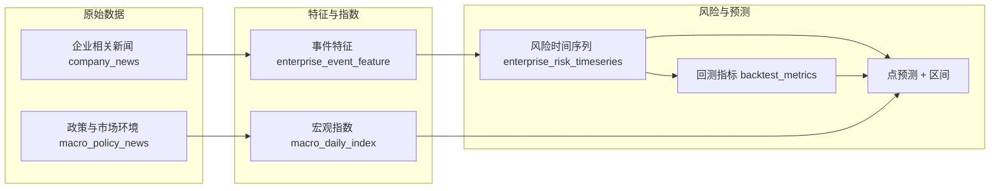

# 风险预测：整体计算过程与底层逻辑

本文档从**原始数据到风险分/预测**梳理完整数据流、各环节公式与底层实现，便于理解系统如何计算企业风险与预测。

---

## 一、数据流总览

**文字流程**：

1. **企业相关新闻**（`company_news`）→ 抽取为 **事件特征**（`enterprise_event_feature`）→ 按日聚合为 **风险时间序列**（`enterprise_risk_timeseries`），得到每日 `risk_score`（0–100）及各维度得分。
2. **政策与市场环境**（`macro_policy_news`）→ 按日汇总为 **宏观指数**（`macro_daily_index`），用于预测时的水平调整。
3. **风险时间序列** + **宏观指数** + **预测配置**（`prediction_config`）→ **点预测**与**预测区间**；**回测**用历史序列得到 MAE、RMSE、方向准确率、残差标准差，残差标准差用于预测区间。

---

## 二、各环节计算公式与底层逻辑

### 2.1 企业风险等级（companies.risk_level）

- **含义**：企业当前展示的风险档位（高/中/低）。
- **计算**：从该企业 `company_news` 中所有条目的 `risk_level` 取**最高档**（高 > 中 > 低）；写入/更新新闻后由后台汇总更新。
- **逻辑**：无社会评价时也可根据新闻显示高/中/低，不再固定为「未知」。

---

### 2.2 事件特征（company_news → enterprise_event_feature）

- **触发**：管理端「重建事件特征」或新闻写入后的流水线；代码见 `backend/services/feature_extraction_service.py`。
- **单条新闻映射**：
  - **事件类型** `event_type`：按 `category` 映射  
    - 法律/合规/监管 → `LEGAL_PENALTY`  
    - 经营/运营 → `BUSINESS`  
    - 财务/金融 → `FINANCIAL_STRESS`  
    - 其他 → `PUBLIC_OPINION`
  - **严重度** `severity_score`（0–1）：先按 `risk_level` 取基础值，再按情绪微调：
    - 高 → 0.8，中 → 0.5，低 → 0.2（缺省 0.3）
    - 情绪为负（`sentiment_score ≤ -0.2`）→ 在基础上 +0.2，上限 1.0
    - 情绪为正（`≥ 0.2`）→ 在基础上 -0.1，下限 0
  - **日期**：优先 `publish_date`，否则 `created_at`，缺省为当天，格式 `YYYY-MM-DD`。

---

### 2.3 每日风险得分（enterprise_event_feature → enterprise_risk_timeseries）

- **触发**：管理端「重建风险时间序列」；代码见 `backend/services/risk_timeseries_service.py`。
- **按日、按企业**：取当日该企业所有 `enterprise_event_feature` 记录，先按事件类型归入维度，再在维度内取平均严重度（0–1）：

| 维度       | 来源事件类型                          |
|------------|----------------------------------------|
| legal      | LEGAL_PENALTY, LITIGATION              |
| business   | BUSINESS, FINANCIAL_STRESS（财务+0.1 封顶 1） |
| media      | PUBLIC_OPINION                         |
| policy     | source_type=POLICY 的政策类            |
| industry   | 预留（当前多为 0）                     |

- **综合风险分**（0–100）：
  - 权重：`wL=0.25, wB=0.25, wM=0.2, wP=0.15, wI=0.15`
  - 公式：
    \[
    \text{risk\_score} = 100 \times (w_L \cdot s_{\text{legal}} + w_B \cdot s_{\text{business}} + w_M \cdot s_{\text{media}} + w_P \cdot s_{\text{policy}} + w_I \cdot s_{\text{industry}})
    \]
  - **保底规则**：若任一方维度得分 ≥ 0.6（对应新闻「高」），则  
    \(\text{risk\_score} = \max(\text{risk\_score},\ 58)\)，使趋势图与「相关新闻为高」一致。
- 同时写入：`news_count`、`neg_news_ratio`、`sentiment_index`、`policy_impact` 等字段。

---

### 2.4 宏观指数（macro_policy_news → macro_daily_index）

- **触发**：刷新「最新政策与市场环境」或定时任务；代码见 `backend/services/macro_index_service.py`。
- **单条新闻得分**（0–1）：按 `dimension` 查表得基础分，若标题/内容匹配负面关键词则 +0.12（上限 1）。
- **当日指数**：当日所有政策新闻得分的**平均**为 `policy_score`；`macro_risk_score = min(1, policy_score * 1.05)`。
- **用途**：预测时用「最近一天」的 `macro_risk_score` 做水平调整（见下）。

---

### 2.5 风险预测（点预测 + 区间）

- **输入**：企业 ID、预测天数 `horizon_days`；从 `enterprise_risk_timeseries` 取该企业历史、从 `macro_daily_index` 取最近宏观、从 `prediction_config` 取参数；代码见 `backend/services/prediction_service.py`。

**步骤 1：趋势估计**

- 取最近 `lookback_days`（默认 30）天的 `risk_score`，用**最小二乘**拟合直线，得到斜率 `slope`；末点即 `base_score`。
- 斜率公式（\(x\) 为 0..n-1 的天数下标，\(y\) 为分数）：
  \[
  \text{slope} = \frac{\sum (x - \bar x)(y - \bar y)}{\sum (x - \bar x)^2}
  \]

**步骤 2：宏观调整**

- 从 `prediction_config` 读取 `macro_adjustment_scale`（默认 20）、`macro_neutral`（默认 0.5）。
- 取最近一天 `macro_risk_score`（0–1）：
  \[
  \text{adjustment} = \text{macro\_adjustment\_scale} \times (\text{macro\_risk\_score} - \text{macro\_neutral})
  \]
- 限制在 ±10 分内。

**步骤 3：点预测**

- 未来第 \(i\) 天（\(i=1 \ldots \text{horizon\_days}\)）：
  \[
  \text{pred\_score}_i = \text{clip}(\text{base\_score} + \text{slope} \times i + \text{adjustment},\ 0,\ 100)
  \]

**步骤 4：预测区间**（若有回测残差）

- 从 `backtest_metrics` 取对应 horizon 的 `residual_std_7d` / `residual_std_30d`；从配置取 `prediction_interval_z`（默认 1.96，约 95% 区间）。
- 区间：
  \[
  [\text{pred\_score}_i - z \times \text{residual\_std},\ \text{pred\_score}_i + z \times \text{residual\_std}]
  \]
  再裁剪到 [0, 100]。

**风险等级**：按点预测分数划分——≥70 高，≥40 中，否则低。

---

### 2.6 回测与准确度指标

- **接口**：`GET /api/v1/predict/backtest?lookback_days=30&horizon_days=7`；代码见 `backend/services/backtest_service.py`。
- **做法**：
  - 对每个企业、每个满足条件的日期 T，仅用 [T−lookback_days, T] 的 `risk_score` 做**线性外推**（与预测服务同一公式，但不加宏观），得到 T+horizon_days 的预测值。
  - 与**真实值**（当日时间序列中的 T+horizon_days 的 risk_score）比较。
  - 同时计算「朴素基准」：预测值 = T 日分数（即不变）。
- **指标**：
  - **MAE**：\( \frac{1}{n}\sum |\text{pred} - \text{actual}| \)
  - **RMSE**：\( \sqrt{\frac{1}{n}\sum (\text{pred} - \text{actual})^2} \)
  - **方向准确率**：预测相对当日是「升/降」与真实「升/降」一致的比例。
  - **残差标准差**：\( \sqrt{\frac{1}{n-1}\sum (e - \bar e)^2} \)，\(e = \text{pred} - \text{actual}\)，写入 `backtest_metrics.residual_std_7d` / `residual_std_30d`，供预测区间使用。
  - **相对朴素基准提升**：\( (\text{MAE\_naive} - \text{MAE\_model}) / \text{MAE\_naive} \)。

---

## 三、关键表与代码位置

| 环节           | 表/概念                    | 主要代码 |
|----------------|----------------------------|----------|
| 事件特征       | enterprise_event_feature   | `feature_extraction_service.py` |
| 风险时间序列   | enterprise_risk_timeseries| `risk_timeseries_service.py`    |
| 宏观指数       | macro_daily_index          | `macro_index_service.py`        |
| 预测参数       | prediction_config         | `prediction_service.py` 读取   |
| 点预测与区间   | 接口返回                   | `prediction_service.py`        |
| 回测与准确度   | backtest_metrics           | `backtest_service.py`          |

---

## 四、小结

- **数据流**：新闻 → 事件特征 → 按日风险分 → 时间序列；政策新闻 → 宏观指数。
- **风险分**：多维度（法律/经营/舆情/政策/行业）加权平均，高分保底 58。
- **预测**：线性趋势 + 宏观水平调整 + 裁剪；区间由回测残差标准差与 z 值得到。
- **准确度**：由回测的 MAE、RMSE、方向准确率、相对朴素基准提升体现；时间序列不足时回测会返回「无有效回测样本」。

更细的方法假设与局限见 [PREDICTION_METHODOLOGY.md](./PREDICTION_METHODOLOGY.md)。
